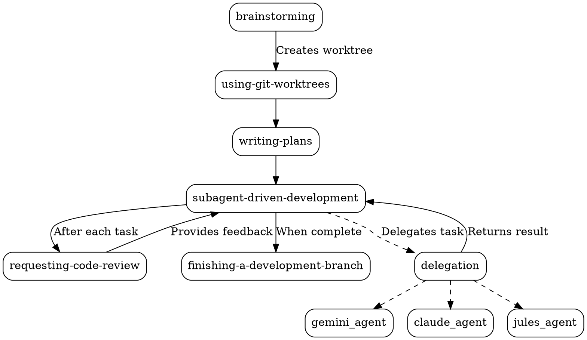

### Superpowers Development Process: A Comprehensive Report

**Introduction**

The `superpowers` development process, defined by the skills in `skills/collaboration`, is a highly structured and prescriptive workflow designed to ensure high-quality code and efficient development. It is built around a set of interconnected skills that guide the developer (or AI agent) through each phase of the development lifecycle, from initial idea to final implementation. The process emphasizes strong principles, such as Test-Driven Development (TDD) and systematic debugging, and provides clear guidance on how to handle common development scenarios.

**Phase 1: Ideation and Design (`brainstorming`)**

The development process begins with the `brainstorming` skill. This skill is used to refine a rough idea into a fully-formed design.

*   **Activation:** The `brainstorming` skill is activated when a new feature or significant change is proposed.
*   **Process:** The skill guides the user through a collaborative dialogue to explore the idea, define its purpose and constraints, and consider alternative approaches.
*   **Key Concepts:**
    *   **One question at a time:** To avoid overwhelming the user.
    *   **Incremental validation:** To ensure the design is on the right track.
    *   **YAGNI (You Ain't Gonna Need It):** To remove unnecessary features.
*   **Transition:** Once the design is complete and validated, it is documented, and the `brainstorming` skill transitions to the `writing-plans` skill, after creating an isolated workspace using the `using-git-worktrees` skill.

**Phase 2: Planning (`writing-plans`)**

The `writing-plans` skill is used to create a detailed, step-by-step implementation plan based on the design created in the previous phase.

*   **Activation:** This skill is activated after the `brainstorming` skill is complete.
*   **Process:** The skill creates a comprehensive plan with exact file paths, complete code examples, and verification steps. For each task in the plan, the user specifies the `agent` (Claude, Gemini, or Jules) and the `complexity` (low, medium, or high).
*   **Key Concepts:**
    *   **Bite-sized tasks:** Each step in the plan is a small, actionable item.
    *   **TDD:** The plan is structured to follow the TDD workflow (write a failing test, write code to pass, refactor).
    *   **Agent and Complexity Specification:** Allows for fine-grained control over the execution of the plan.
*   **Transition:** After the plan is created, it is handed off to the `subagent-driven-development` skill for execution.

**Phase 3: Execution (`subagent-driven-development`)**

The `subagent-driven-development` skill is the primary execution engine of the `superpowers` process. It takes the detailed implementation plan from the `writing-plans` skill and executes it task by task.

*   **Activation:** This skill is activated after the `writing-plans` skill is complete.
*   **Process:** For each task in the plan, the skill:
    1.  Reads the `agent` and `complexity` from the plan.
    2.  Uses the `delegation` skill to dispatch the task to the specified agent with the specified complexity.
    3.  Waits for the task to be completed.
    4.  Uses the `requesting-code-review` skill to review the work.
    5.  If necessary, delegates fixes to the agent.
*   **Key Concepts:**
    *   **Iterative Development:** The cycle of delegation, execution, and review allows for rapid, iterative development.
    *   **Multi-Agent Delegation:** The skill can delegate to different AI agents (Claude, Gemini, Jules) based on the requirements of each task.
    *   **Quality Gates:** The mandatory code review after each task ensures that quality is maintained throughout the process.

**Phase 4: Code Review (`requesting-code-review`)**

Code review is an integral part of the `superpowers` process and is used in all three execution paths.

*   **Activation:** The `requesting-code-review` skill is activated after a task or batch of tasks is complete.
*   **Process:** The skill dispatches a `code-reviewer` sub-agent to review the changes. The sub-agent provides feedback on the code, which is then used to improve the implementation.
*   **Key Concepts:**
    *   **Review early, review often:** To catch issues before they become major problems.
    *   **Automated review:** The use of a sub-agent for code review provides a consistent and objective assessment of the code.

**Phase 5: Completion (`finishing-a-development-branch`)**

Once all tasks in the plan are complete and have been reviewed, the `finishing-a-development-branch` skill is used to finalize the work.

*   **Activation:** This skill is activated after the execution of the plan is complete.
*   **Process:** The skill verifies that all tests are passing and then presents the user with four options: merge the branch, create a pull request, keep the branch as-is, or discard the work.
*   **Key Concepts:**
    *   **Verification before completion:** To ensure that the work is in a good state before it is integrated.
    *   **Structured options:** To provide a clear and unambiguous way to complete the work.

**Core Principles and Cross-Cutting Skills**

The `superpowers` process is built on a foundation of core principles and cross-cutting skills that are used throughout the workflow:

*   **Worktree Management (`using-git-worktrees`):** This skill is used to create isolated workspaces for each task, ensuring that different lines of work don't interfere with each other.
*   **Parallelism (`dispatching-parallel-agents`):** This skill is used to dispatch multiple agents to work on independent tasks concurrently, speeding up the development process.
*   **Delegation (`delegation`, `gemini-agent`, `claude-agent`, `jules-agent`):** These skills provide the foundation for delegating tasks to external AI agents, allowing for greater flexibility and scalability.

**Workflow Diagram**

